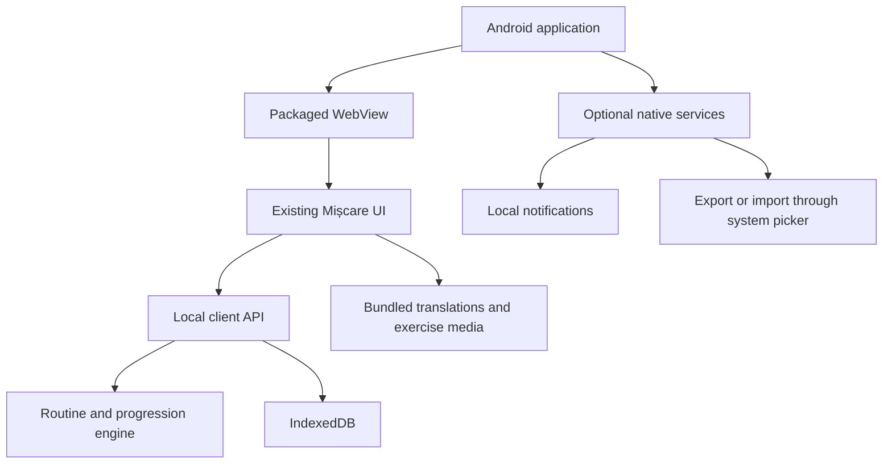

# Android conversion audit and on-device architecture

Date: 2026-09-12

## Decision

Mișcare can run fully on an Android device without an application server. For that requirement, the recommended Android architecture is a small native shell containing the existing HTML, CSS, JavaScript, translations, icons, and exercise media, with all profile, routine, progression, and workout-log operations performed locally.

A Trusted Web Activity was the best fit while the hosted PWA remained the source of the app. It is not the right fit for a strict no-server requirement because the experience is still web content supplied by an HTTPS origin. Android supports compiling web content into an application and loading it locally through `WebViewAssetLoader`, including JavaScript, CSS, and image subresources, without an internet connection. A Capacitor Android project is the shortest practical route to the same bundled-WebView result while retaining the current web UI.

The Android app should therefore use:

- A packaged WebView shell, preferably Capacitor unless the project needs enough custom native behavior to justify a small Kotlin shell.
- A local JavaScript service/repository API instead of HTTP calls to Express.
- IndexedDB for structured application data. Room or native SQLite is an alternative if native database access, encryption, or complex backup integration becomes necessary.
- Local Android notifications for reminders, if reminders are implemented.
- Google Play releases as the only source of executable UI and catalogue updates.

## What must move off the server

The current offline fallback is not equivalent to a full local app. It generates only fixed fallback routines and stores a small amount of state in `localStorage`. The normal adaptive behavior still depends on Express endpoints.

| Current responsibility | Current implementation | On-device replacement |
| --- | --- | --- |
| Static application delivery | Express serves `web/` | Bundle `web/` in the Android application |
| Device authentication | Bearer token, cookie, invites | Remove for a personal local app |
| Profile and limitations | SQLite through `/api/profile` | IndexedDB profile record |
| Daily routine | `/api/routine/today` | Move the pure routine generator into a shared client module |
| Progression proposals | Three progression endpoints | Local transaction updating profile and progression history |
| Workout journal | `/api/routine/log` and `/api/logs` | IndexedDB workout records keyed by a client UUID |
| Totals | SQLite recomputation | Recompute from the local workout journal |
| Device and invite administration | Admin endpoints | Remove unless remote administration remains a product requirement |
| Reminders | Not implemented | Android local scheduled notifications; no push server required |
| Application updates | Web deployment and service worker | Play Store application update |

The routine catalogue and selection engine are already mostly portable: `server/routine.js` is ordinary JavaScript and imports the web equipment module. The work is mainly extracting it into a browser-safe shared module and replacing its server/database inputs with a local repository.

One direct HTTP call also exists outside `web/server-client.js`: the device-label update in `web/app.js`. It should go through the same local client interface so the Android build contains no hidden server dependency.

## 1. Identity, invites, and migration

The current browser identity is a device token in `localStorage` (`web/server-client.js:5-16`). A standalone check in `web/app.js:21-24` recognizes installed PWAs and Trusted Web Activities but not an ordinary packaged WebView. Invitations are single-use after a 60-minute rebind window (`server/auth.js:190-201`).

For a local-only Android app, device tokens, cookies, CORS, and invitation redemption have no technical purpose. Remove those paths from the Android build rather than emulating an HTTP server inside the app.

Existing users still need a deliberate transition. The Android app cannot automatically read storage belonging to Chrome or an installed PWA. Choose one of these migration mechanisms before release:

1. Export the profile and journal from the PWA into a versioned JSON file and import it through Android's system document picker.
2. Generate a one-time migration payload or QR code while the old server still exists.
3. Start the Android app with a new local profile and clearly tell users that old history is not transferred.

An offline-only entitlement cannot be centrally revoked. If invitations are intended to control who may run the app, use a Play closed/private distribution track or accept that a local activation secret can eventually be copied or reverse-engineered. Strong remote revocation inherently requires a remote authority.

## 2. Local persistence and data integrity

The present offline path acknowledges failed operations without later reconciliation:

- `updateProfile()` writes `localStorage`, silently ignores a failed server update, and has no retry queue (`web/server-client.js:133-149`).
- `logWorkout()` changes local totals and records a local log before attempting the server; it also silently ignores failure (`web/server-client.js:279-316`).
- `getLogs()` prefers server results after reconnection, which can hide local-only workouts (`web/server-client.js:319-338`).

These split-brain problems disappear once the local database is the only source of truth, but the local implementation still needs transactions. A completed workout transaction should insert the journal record and then derive totals from the journal. It should not increment counters independently because crashes between those operations create inconsistent state.

Recommended IndexedDB stores:

- `meta`: schema version, installation ID, and migration state.
- `profile`: one active profile, including level, equipment, limitations, and preferences.
- `workouts`: UUID, timestamp, local date, time zone, routine snapshot, completion, feedback, and exercises performed.
- `progression`: accepted or reverted changes and the state needed for undo.
- `settings`: locale, sound, reduced-motion preference, and reminder settings.

Use versioned migrations, test upgrades with real old databases, and provide an explicit delete-all-data action. For resilience, offer an optional user-initiated encrypted export. Do not write exports to a generally readable path; use Android's system file picker and make the privacy implications clear.

## 3. Dates and time zones

Client and server currently derive a calendar day with `new Date().toISOString().slice(0, 10)` (`web/server-client.js:204`, `web/server-client.js:212`, `web/server-client.js:293`, `server/index.js:327`, and `server/index.js:424`). That value is a UTC date. In Bucharest, a new app day therefore begins around 02:00 or 03:00 local time instead of midnight.

Every workout should store:

- An absolute timestamp.
- The local calendar date at completion.
- The IANA time zone, such as `Europe/Bucharest`.

The daily routine, done-today state, streaks, and cache keys should all use one local-date function. Define how travel behaves; the least surprising rule is usually the device's current time zone when the workout is completed.

## 4. Bundled WebView behavior

Do not load the app with `file://` URLs or enable universal file access. Android recommends `WebViewAssetLoader` because it exposes packaged resources through an HTTP(S)-style origin and preserves same-origin behavior. Capacitor provides an equivalent local-origin model for its bundled `webDir`.

Use separate web build modes:

- Web/PWA build: service worker enabled and server client available.
- Android local build: service worker disabled, local repository selected, install banners and invite UI removed, and all assets bundled.

The current service worker performs network-first requests and precaches nothing (`web/sw.js:31-63`). It is unnecessary in the packaged Android build and can conflict with Play-delivered asset versions. The Android application package should be the single version authority.

Restrict WebView navigation to the packaged origin. Open external HTTPS links in a Custom Tab or browser. Keep file access and mixed content disabled. Avoid `addJavascriptInterface`; if a native bridge is needed, expose only narrow operations to an explicit origin using a modern message listener.

## 5. Security, privacy, and backup

Removing the server removes the current bearer-token, cookie, CORS, and public-admin risks. It also gives a strong privacy story: workouts and limitations do not leave the device during ordinary use.

There is one easily missed exception. Android Auto Backup is enabled by default and can upload application data to the user's Google Drive. A strict on-device promise requires explicit backup rules that exclude the health/profile database from cloud backup, or `android:allowBackup="false"`. Android 12 and later need `data-extraction-rules`; test cloud restore and device-to-device transfer separately because behavior varies by Android version and manufacturer.

If the product instead promises recoverability across device loss, permit an encrypted backup and describe it accurately. “Stored only on this device” and automatic cloud recovery cannot both be unconditional promises.

The app still provides health and fitness functionality even when no data is transmitted. Complete the Google Play Health Apps declaration, publish a privacy policy in the store and inside the app, and complete Data Safety based on the final application and every included SDK. Avoid analytics and crash SDKs unless their data flows are intentionally accepted and declared.

## 6. Android UI and accessibility

The existing wide-screen CSS at `web/app.css:1975-2140` is a useful base for tablets and foldables. The web manifest still requests `portrait-primary` (`web/manifest.webmanifest:9`), while Android 16 ignores orientation and resizability restrictions on large displays for applications targeting API 36. Support rotation, split screen, fold/unfold, and activity recreation without losing an active workout.

Required fixes and tests:

- Remove `user-scalable=no` from `web/index.html:5` so users can zoom.
- Test the numerous `0.68rem` to `0.85rem` labels at Android's 200% font setting.
- Measure all interactive elements against a 48dp touch target.
- Test TalkBack reading order, labels, focus restoration, and live timer announcements.
- Verify status/navigation bar insets and keyboard resizing under mandatory edge-to-edge behavior.
- Keep the current overlay history behavior in `web/dismissable.js`; define whether Back from a secondary primary tab returns to Today or exits.
- Honor reduced motion for exercise media. The current media query stops some CSS transitions but animated WebP images continue playing. Use the JPG still or provide a pause control.

## 7. Exercise media, audio, and lifecycle

The current checked-out exercise directory contains 45 JPG stills totaling about 2.8 MB and 45 animated WebPs totaling about 9.2 MB. That is reasonable for a bundled application. Keep the staged GIF removals in the eventual release commit; regenerating and bundling GIF byproducts would substantially increase its size.

The compendium currently creates an image for every exercise without `loading="lazy"` (`web/compendium-view.js:309-310`). Add lazy loading and asynchronous decoding to reduce startup decoding and memory pressure. Only load animated media for the selected exercise or active guided workout.

The guided workout requests a screen wake lock and re-requests it after returning to the foreground (`web/routine-view.js:12-37`), which is a sound starting point. Test process death and background/foreground transitions. Reuse a single `AudioContext` instead of constructing one for every sound. Speech currently requests `ro-RO` regardless of the active UI locale (`web/routine-view.js:119-130`); choose the current locale and handle devices without a matching voice.

Local reminders are possible without a server. Use Android local notifications, request notification permission at the point where a user enables reminders, create a notification channel, and avoid exact alarms unless the product truly requires exact timing.

## 8. Play release requirements

As of this audit, new applications and updates submitted to Google Play must target Android 16 / API 36. Applications targeting Android 15 or later run edge-to-edge by default. API 36 also makes large-screen layouts resizable and ignores common orientation constraints.

Choose the package ID before the first Play release because it is the application's permanent identity. Publish an Android App Bundle using Play App Signing. If Capacitor or any plugin includes native `.so` libraries, verify 16 KB page-size compatibility; Play blocks affected updates starting 2027-02-01.

The current install text promises reliable notifications, but the code has no `PushManager`, service-worker push handler, or notification-permission flow. For a local app, either implement local reminders before repeating this claim in the store listing or remove the claim.

The project is GPL-3.0-or-later. Preserve license notices and provide corresponding source for the distributed Android work as required by that license.

## 9. Recommended implementation sequence

1. Extract `server/routine.js` and progression calculations into browser-safe shared modules with no Node or database imports.
2. Define a local client interface matching the frontend operations and remove direct `/api` calls from views.
3. Implement IndexedDB schema, migrations, transactional journal writes, recomputed totals, data deletion, and JSON export/import.
4. Add an Android build flag that selects the local client, disables the service worker, and hides server/invite UI.
5. Create the Capacitor Android shell, bundle the current web directory, lock navigation to the local origin, and configure backup rules.
6. Add native local notifications only if reminders are part of the first release.
7. Fix local dates, zoom, reduced motion, locale-aware speech, and lazy media loading.
8. Test fresh install, application upgrade, process death during a workout, reboot, airplane mode, storage deletion, export/import, rotation, foldables, 200% fonts, TalkBack, and Android Back.
9. Prepare the privacy policy, Health Apps declaration, Data Safety form, store assets, AAB, and Play signing configuration.

## 10. Acceptance criteria for “no server required”

The Android build qualifies as fully on-device when all of the following pass with airplane mode enabled from before first launch:

- The application starts and every locale can be selected.
- All exercise stills and animations are available.
- A profile can be created and edited.
- Daily routines use the full adaptive generator rather than fixed fallback templates.
- Workouts can be completed, listed, deleted, and reflected correctly in totals.
- Progression proposals can be accepted, declined, and reverted.
- The application survives process death, reboot, rotation, and a Play-style version upgrade without losing data.
- No request is made to the old origin or any other network endpoint.
- Delete all data removes the profile, journal, settings, and pending notifications.
- Backup behavior matches the privacy policy.

## Official references

- [Load in-app content with WebViewAssetLoader](https://developer.android.com/develop/ui/views/layout/webapps/load-local-content)
- [Android WebView security guidance](https://developer.android.com/privacy-and-security/security-best-practices)
- [Android Auto Backup](https://developer.android.com/identity/data/autobackup)
- [Trusted Web Activity overview](https://developer.chrome.com/docs/android/trusted-web-activity)
- [Android App Links and assetlinks.json](https://developer.android.com/training/app-links/configure-assetlinks)
- [Google Play target API requirements](https://support.google.com/googleplay/android-developer/answer/11926878)
- [Android 16 target behavior changes](https://developer.android.com/about/versions/16/behavior-changes-16)
- [Google Play Health Apps declaration](https://support.google.com/googleplay/android-developer/answer/14738291)
- [Google Play Data Safety](https://support.google.com/googleplay/android-developer/answer/10787469)
- [Android 16 KB page-size compatibility](https://developer.android.com/guide/practices/page-sizes)
- [Accessible responsive web design](https://web.dev/articles/accessible-responsive-design)
